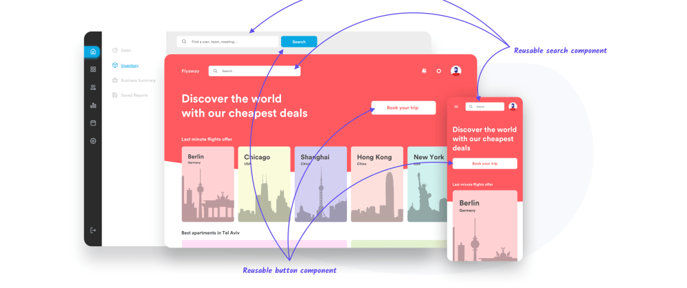
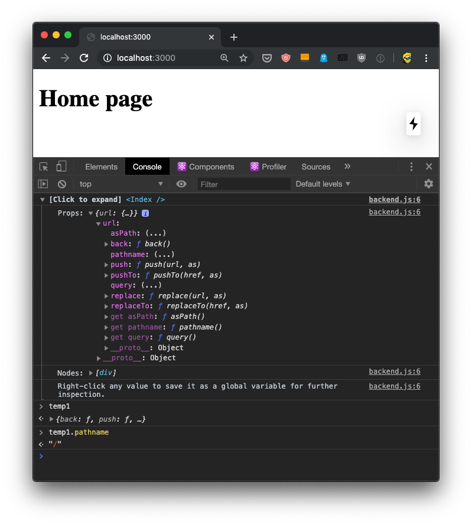
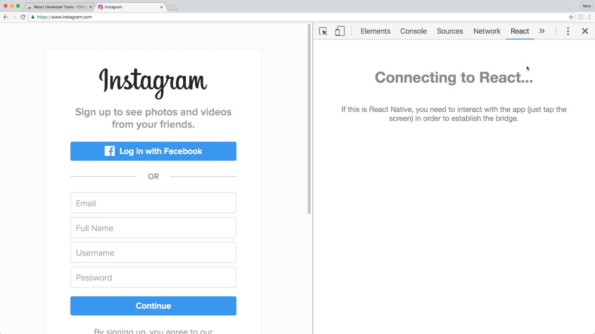

ReactJS Expanded Report
=======================

**Thesis:** What is React, where does react show up in our modern technology,
and why is it used there?

* What is React

  * Introduction to Javascript libraries
  * User Interfaces (Reference [#f6]_)
  * What is a UI Design (Reference [#f6]_)
  * Why are UI Designs important (Reference [#f6]_)

* How is React used

  * Introduction to React (Reference [#f1]_ + screenshot)
  * What are components (Reference [#f1]_ + code samples)
  * Render method (Reference [#f1]_ + code samples)

* What competitors are there

  * React origins (Reference [#f7]_)
  * Competitors
  * How react is unique from others (Reference [#f7]_)

* What technology uses React

  * Different technologies
  * Is the list of technologies diverse

* What companies use React

  * Different companies (Reference [#f8]_ + screenshots)
  * Where in those companies is React being used (Reference [#f8]_ + screenshots)

* Why is React the best right now

  * Before React (Reference [#f9]_)
  * Benefits of using React (Reference [#f9]_)
  * Where should React be used (Reference [#f9]_)

    * Dashboards
    * Reacts DOM updates fast
    * Social Networks
    * Retail
    * Mobile Apps

Why is React the best right now?
--------------------------------
React is one of the best of its kind right now, but why is that true and how did
it get there? First off you need to look at what it was like before React came
out to understand the need for it. Then it is very easy to see what the main
benefits of React are and why someone would want to use it. Finally, looking at
all the different types of places that React is used will help show how it is
above all its competition.

The best way, in my opinion, to understand why React is the best right now, is
to understand what it was like at the start. Before React became such a big thing,
there was a completely different approach to web development. All you did was
make static html pages and render them with PHP. This way was used for a very
long time before javascript libraries exploded with popularity. Then React was
introduced and paved the way for developers to create dynamic applications very
fast.

At first it was mainly used to render views on different applications. What
changed the game was that react allowed reusable components that didn't depend
on each other. Essentially, what made react so good compared to the previous way
was the speed and efficiency it has. This means that when it comes to things like
bugs or certain aspects of your application breaking, it is controlled within an
area. Since components are independent of each other, one breaking doesn't mean
everything goes down.

With all this information about react when it first came out, how is it still better
than competitors now? Firstly, a big part of choosing a framework is the
complexity of it. No one wants to use a framework that is difficult to learn and
implement to an application. React is a very simple and easy to learn framework
that makes using it for advanced or beginners very simple.

Another huge reason why React is still top of its games is all about how reusable
it is. React, as mentioned earlier, is made up of components. These are things
like buttons, menus, checkboxes, and so on. Why React is so good is because you
can reuse all these different components which simply means less redundant code.

.. image:: Components.jpg

Finally, there is a large collection of developer tools that exists out there.
Its easy to think of this like a shortcut in a giant maze. It is amazing to have
pre build and ready to use components of all different kinds. This simply makes
writing you application so much faster since you are not starting from scratch.
What continues to make React so good to use right now is how large the implication
of it is.

So many different type of technologies can make great use of React. For starters,
any type of dashboard makes great use of React. It is very important to be able
to display information in an easy to follow way. React does this very well since
it has reusable components, and a very efficient way of updating your applications.

Another very common place that React is used, is through social networks.
Initially, React was developed by Facebook and then became open-source.
React is used all throughout different social networks for many of the same reasons
mentioned earlier. The UI or client side look and ease makes React an easy choice
for developers when it comes to things like Facebook or Instagram.

Then things like retail web application also make use of React for many of the
same reasons. The reusable components makes building a retail application much
easier as you don't want any components to be dependent on each other. With
React, when you have an issue with one of your components, it isn't the end of
the world as one component has an issue. You cant have a retail application
having one issue bring down everything tied with it.

So as you can see, so many different groups make high use of React in many
different ways. With all the benefits of React, it is easy to see how React is
still the top of the line for its kind. If this isn't enough, then look at all
the big name companies that use React.

.. [#f1] Facebook. (2021). “`React – A JavaScript Library for Building User Interfaces
   <https://reactjs.org/>`_”. Retrieved 2:35 PM, February 10, 2021, from
   https://reactjs.org/

.. [#f2] Chand, Swatee. (2020, April 29). “`What Is React: JavaScript Library For
   Building User Interfaces <https://www.edureka.co/blog/what-is-react/>`_”.
   Edureka. Retrieved 2:35 PM, February 10, 2021, from
   https://www.edureka.co/blog/what-is-react/

.. [#f3] Accomazzo, Anthony, et al. "Fullstack React: the Complete Guide to
   ReactJS and Friends". Fullstack.io, 2017. Retrieved 2:35 PM, February 10, 2021,
   from https://github.com/leminhson2398/books/blob/master/fullstack-react-book-r36.pdf

.. [#f4] Aggarwal, Sanchit. (2018, March). “`Modern Web-Development Using ReactJS
   <http://ijrra.net/Vol5issue1/IJRRA-05-01-27.pdf>`_”.
   Ijrra. Retrieved 2:35 PM, February 10, 2021, from http://ijrra.net/Vol5issue1/IJRRA-05-01-27.pdf

.. [#f5] React Conf. (2019, October 15). "`React Conf 2019 Day 1
   <https://www.youtube.com/watch?v=UxoX2faIgDQ>`_". Retrieved 2:35 PM, February
   10, 2021, from https://www.youtube.com/watch?v=UxoX2faIgDQ

.. [#f6] Hannah, Jaye. (2019, October 2). “`What Is A User Interface, And What Are The Elements That Comprise One?
   <https://careerfoundry.com/en/blog/ui-design/what-is-a-user-interface/>`_".
   CareerFoundry. Retrieved 11:30 AM, March 1, 2021, from
   https://careerfoundry.com/en/blog/ui-design/what-is-a-user-interface/

.. [#f7] Tricou, Antanas. (2020, May 24). “`React vs the Competition
   <https://levelup.gitconnected.com/react-vs-the-competition-d8cbb09baf9a>`_”.
   Gitconnected. Retrieved 11:30 AM, March 1, 2021, from,
   https://levelup.gitconnected.com/react-vs-the-competition-d8cbb09baf9a

.. [#f8] Węglarz, Rafał. (2020, November 20). “`9 Companies That Use React
   <https://www.droptica.com/blog/9-companies-use-react/>`_”. Droptica.
   Retrieved 11:30 AM, March 1, 2021, from,
   https://www.droptica.com/blog/9-companies-use-react/

.. [#f9] Kasundra, Prayaag. (2020, February 24). “`Why and Where Should You Use React for Web Development?
   <https://www.simform.com/why-use-react/#:~:text=React%20was%20primarily%20used%20to,off%20with%20the%20remaining%20elements.>`_”
   Simform. Retrieved 11:30 AM, March 1, 2021, from,
   https://www.simform.com/why-use-react/#:~:text=React%20was%20primarily%20used%20to,off%20with%20the%20remaining%20elements.